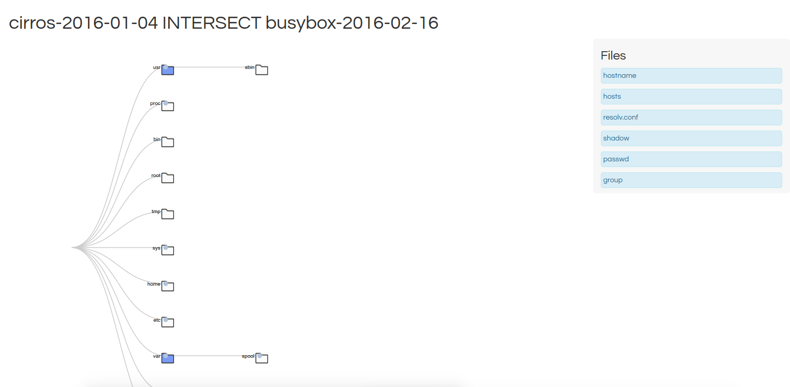

# Container Similar Tree

What do two containers have in common, in terms of files and folders? shub provides a command line function for rendering a view to (immediately) show the similarity between to container images:

      shub --simtree --images cirros-2016-01-04.img.zip,busybox-2016-02-16.img.zip

Note that we are specifying `images` for the argument instead of `image`, and it's a single string of image names separated by a comma. For this argument you can specify an image or package.

An [interactive demo](https://singularityware.github.io/singularity-python/examples/similar_tree) is also available.

### Questions

**Why do I see some of the same folders as I saw for [../difference_tree](../difference_tree)**

In order to parse lower levels of the tree, we have to include parents. So, for example, the folder `home` would obviously be shared by two images, however if there are subfolders that exist for one image but not the other, we must render `home` in the difference tree. Thus, you might see `home` appear in both visualizations that show the intersect and difference.

